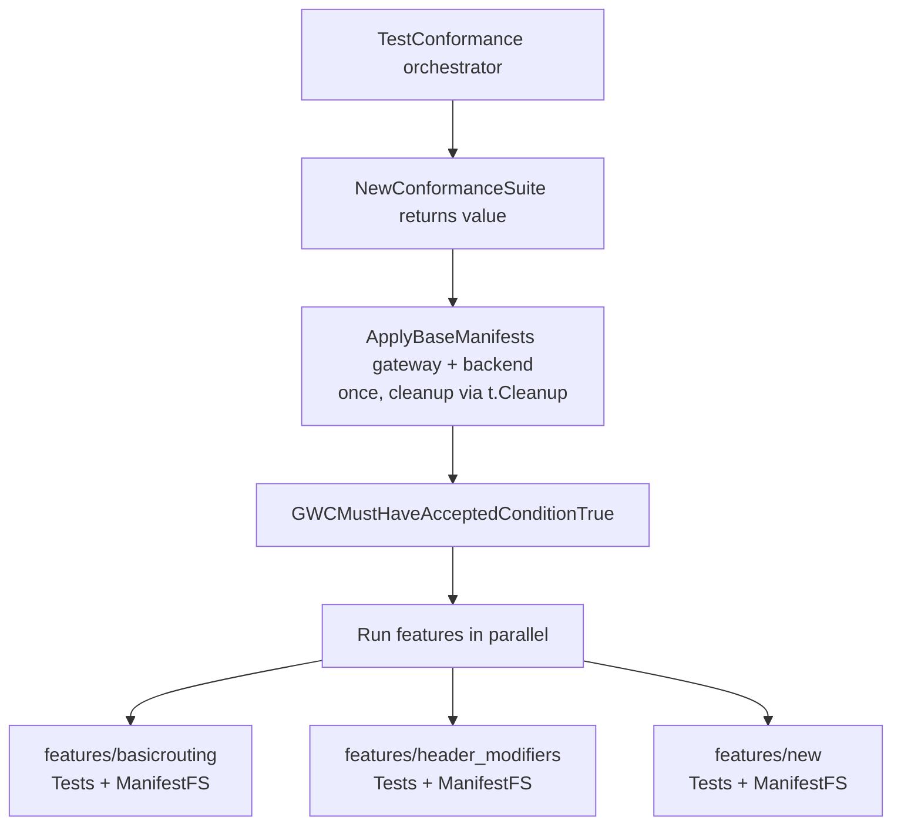

# EP-13891: E2E Testing Framework Selection — Adopt Gateway API Conformance Framework

* Issue: [13891](https://github.com/kgateway-dev/kgateway/issues/13891)
* Parent epic: [Modernize and improve kgateway end-to-end testing](https://github.com/kgateway-dev/kgateway/issues/13351)
* Reference PRs:
  * [#13782 — fast e2e tests](https://github.com/kgateway-dev/kgateway/pull/13782)
  * [devc007/kgateway#1 — basicrouting POC using sigs/e2e-framework](https://github.com/devc007/kgateway/pull/1)
  * [#12981 — Good tests](https://github.com/kgateway-dev/kgateway/issues/12981)
  * [#12993 — initial fast e2e attempt](https://github.com/kgateway-dev/kgateway/pull/12993)

<!-- toc -->

- [Background](#background)
- [Motivation](#motivation)
- [Goals](#goals)
- [Non-Goals](#non-goals)
- [Implementation Details](#implementation-details)
  - [Frameworks Under Consideration](#frameworks-under-consideration)
    - [Refactor current kgateway custom framework](#refactor-current-kgateway-custom-framework)
    - [`sigs.k8s.io/e2e-framework`](#sigsk8sioe2e-framework)
    - [Gateway API conformance framework](#gateway-api-conformance-framework)
  - [Comparison](#comparison)
  - [Same test in each framework](#same-test-in-each-framework)
    - [Gateway API conformance framework *(recommended)*](#gateway-api-conformance-framework--testsigs_gateway_conformancefeaturesbasicroutingbasic_routinggotestsigs_gateway_conformancefeaturesbasicroutingbasic_routinggo-recommended)
    - [Current framework](#current-framework--teste2efeaturesbasicroutingsuitegoteste2efeaturesbasicroutingsuitego)
    - [sigs/e2e-framework POC *(rejected)*](#sigse2e-framework-poc--teste2e_sigsfeaturesbasicroutingrouting_testgoteste2e_sigsfeaturesbasicroutingrouting_testgo-rejected--see-alternative-2alternative-2--adopt-sigsk8sioe2e-framework)
  - [Recommendation](#recommendation)
  - [Migration Plan](#migration-plan)
    - [Phase 1 — Land the canonical pattern (PRs 1–2)](#phase-1--land-the-canonical-pattern-prs-12)
    - [Phase 2 — Archive the explored alternative (PR 3)](#phase-2--archive-the-explored-alternative-pr-3)
    - [Phase 3 — Migrate a representative slice (PRs 4–6)](#phase-3--migrate-a-representative-slice-prs-46)
    - [Phase 4 — kgateway-specific helper package (PRs 7–8)](#phase-4--kgateway-specific-helper-package-prs-78)
    - [Phase 5 — Broaden migration (opportunistic)](#phase-5--broaden-migration-opportunistic)
    - [Phase 6 — Decommission (when `test/e2e/features/` is empty)](#phase-6--decommission-when-teste2efeatures-is-empty)
  - [Test Plan](#test-plan)
- [Alternatives](#alternatives)
  - [Alternative 1 — Keep the custom framework, optimize it](#alternative-1--keep-the-custom-framework-optimize-it)
  - [Alternative 2 — Adopt `sigs.k8s.io/e2e-framework`](#alternative-2--adopt-sigsk8sioe2e-framework)
  - [Alternative 3 — Maintain two frameworks indefinitely](#alternative-3--maintain-two-frameworks-indefinitely)
- [Approval](#approval)

<!-- /toc -->

## Background

kgateway maintains a large suite of end-to-end (e2e) tests that exercise the full path from Kubernetes Gateway API resources through the kgateway control plane to the dataplane proxies (Envoy and agentgateway). These tests live under [`test/e2e/`](../test/e2e/) and use a custom framework built on top of [`testify/suite`](https://pkg.go.dev/github.com/stretchr/testify/suite).

The framework has accumulated significant capability over time, but it has also become slow to run and idiosyncratic enough that new contributors pay a real onboarding tax before writing their first test.

## Motivation

The current custom framework is **slow** (per-test setup — manifest application, image pre-pull, dynamic resource discovery, `EventuallyPodsRunning` — dominates execution time), **idiosyncratic** (its abstractions are unique to kgateway and require contributors to internalize a kgateway-specific stack before writing a useful test).

The parent epic [#13351](https://github.com/kgateway-dev/kgateway/issues/13351) asks us to evaluate whether kgateway should keep evolving the existing framework or migrate (in whole or in part) to one of the established alternatives in the Kubernetes ecosystem. The complementary write-up in [#12981 ("Good tests")](https://github.com/kgateway-dev/kgateway/issues/12981) and the prototype in [#12993 ("fast e2e tests")](https://github.com/kgateway-dev/kgateway/pull/12993) make a concrete case for what a faster, simpler test loop should look like.

This design document compares three candidates, recommends a path forward, and proposes a migration strategy.

## Goals

* **Speed & efficiency.** Shared cluster and kgateway install across the suite, native Kubernetes clients, per-test namespace isolation to enable parallel execution.
* **Accessibility.** Easy to read and write. Minimize the kgateway-specific ceremony a contributor has to learn before writing their first test — some will inevitably exist (policy CRD status helpers, install glue), but it should be a thin layer over conventions the wider community already knows, not a bespoke stack.
* **Reliability & reproducibility.** Same result locally and in CI. Deterministic setup and teardown. No cross-test state leakage.
* **Maintenance burden.** Lean on upstream/community-maintained test code rather than carrying kgateway-specific equivalents in-repo.


## Non-Goals

* This proposal does not cover migrating every existing e2e test or replacing the Gateway API conformance test runner. Migration scope will be defined in the epic, and the upstream conformance suite is consumed as-is.
* Change how kgateway is installed for tests (Helm-from-local-chart). Orthogonal to framework choice.
* Replace unit tests, gateway translator tests, or load tests. This document is scoped to functional e2e.
* Design the full integration of the chosen framework into the kgateway codebase. The scope here is validating functional fit at the POC level; production wiring (CI matrices, helper packages, large-scale migration) is delivered incrementally through the Migration Plan.

## Implementation Details


### Frameworks Under Consideration

#### Refactor current kgateway custom framework

Location: [`test/e2e/`](../test/e2e/), with the suite-level base in [`test/e2e/tests/base/base_suite.go`](../test/e2e/tests/base/base_suite.go).

The framework is built around three central abstractions:

* `TestInstallation` ([`test/e2e/test.go`](../test/e2e/test.go)) — bundles a runtime context, cluster context, install context, an `Actions` provider (Helm, kubectl, curl wrappers), an `Assertions` provider (Gomega-based helpers), and a per-test failure dump directory.
* `BaseTestingSuite` — embeds `testify/suite.Suite` and wires the test lifecycle (`SetupSuite`, `BeforeTest`, `AfterTest`, `TearDownSuite`) to manifest application, image pre-pulling, dynamic resource discovery, and Gateway API version gating.
* `SuiteRunner` ([`test/e2e/suite.go`](../test/e2e/suite.go)) — registers and runs a set of `testify` suites against a single `TestInstallation`.

Tests are organized as `features/<area>/suite.go` and registered in `tests/<entrypoint>_tests.go`. Each test method on a suite struct is treated as a Go subtest.

Strengths:

* **Tight kgateway integration.** Helm install flow, failure dump, image pre-pull, dynamic proxy resource awaiting, and Gateway API version/channel guards are all built in.
* **Mature assertion library.** `assertions.Provider` exposes `AssertEventualCurlResponse`, `AssertEventuallyConsistentCurlResponse`, `EventuallyGatewayAddress`, etc. — purpose-built for this product.
* **Manifest-first authoring.** `TestCase{Manifests: []string{...}}` matches how users actually drive kgateway (`kubectl apply -f`).
* **Failure forensics.** On failure the framework dumps namespace state, controller logs, and resource descriptions to a per-test directory. This is invaluable in CI.
* **Persistence flags.** `PERSIST_INSTALL`, `FAIL_FAST_AND_PERSIST`, and `SKIP_INSTALL` enable iterative local debugging without paying the install cost on every run.

Weaknesses (these are the cracks the epic calls out):

* **Slow per-test cycle.** Each suite re-applies its setup manifests and waits for pods. With pre-pull, `EventuallyObjectsExist`, dynamic resource discovery, and `EventuallyPodsRunning`, a single test can spend tens of seconds on setup before it ever issues a curl.
* **Heavy abstraction.** A new contributor has to learn `TestInstallation`, `BaseTestingSuite`, `TestCase`, `Setup`/`SetupByVersion`, `Actions.*`, `AssertionsT(t).*`, the `SuiteRunner`, and the difference between `Setup` and per-test `TestCases` before they can write a basic routing test. The actual test method is often the smallest part of the file.
* **Coupled installation and execution.** A `TestInstallation` is per-entrypoint, so testing kgateway under multiple Helm value sets requires a new `*_test.go` file *and* a new GitHub Actions invocation. This is the "1:1:1 relationship" called out in [`test/e2e/README.md`](../test/e2e/README.md).
* **Bespoke knowledge.** None of this transfers to other Kubernetes projects. Reviewers from outside the project pay a learning tax.

#### `sigs.k8s.io/e2e-framework`

Upstream project: <https://github.com/kubernetes-sigs/e2e-framework>. A POC migration of the basicrouting tests lives at [`test/e2e_sigs/`](../test/e2e_sigs/) ([devc007/kgateway#1](https://github.com/devc007/kgateway/pull/1)).

The framework provides a Go-test-native programming model:

* `env.Environment` is the single object that owns lifecycle. `TestMain` constructs it, optionally registers `Setup` / `Finish` steps (e.g., create a kind cluster, install CRDs, deploy the controller), and calls `testenv.Run(m)`.
* Tests are plain `func TestX(t *testing.T)` functions. They build one or more `features.Feature` values using a fluent builder (`features.New(name).WithLabel(...).Setup(...).Assess(...).Teardown(...).Feature()`) and execute them with `testenv.Test(t, feat)`.
* `envconf.Config` carries the cluster client, namespace, kubeconfig path, and CLI flags — it is threaded into every step's closure.
* `envfuncs` provides reusable building blocks (`CreateCluster`, `CreateNamespace`, `LoadDockerImageToCluster`, etc.) that can be composed into `Setup`/`Finish` chains.

Strengths:

* **Standard Go test idioms.** No reflection-based suite runner. `go test -run TestGatewayWithRoute -v ./test/e2e_sigs/features/basicrouting` works the way every Go developer expects.
* **Composable lifecycle.** Each feature owns its own `Setup` / `Assess` / `Teardown`. Per-feature state lives in the `context.Context` returned from each step, so there is no shared mutable suite struct.
* **Labels and feature gates.** `WithLabel("type", "smoke")` plus `--feature` / `--labels` flags let CI pick subsets without restructuring code.
* **Familiar to the community.** The framework is used by Crossplane, kueue, and several other CNCF projects. New contributors who have written tests for those projects will be immediately productive.
* **Light dependency surface.** The package is small, focused, and stable. No reflection magic on test method names.

Weaknesses:

* **No support for kgateway-specific concerns.** Helm-install-from-local-chart, failure dumps, image pre-pull, dynamic proxy resource discovery, and Gateway API version gating do not exist out of the box. We would have to port these or pay the cost in flake and triage.
* **Manifest application is bring-your-own.** The framework gives you a controller-runtime client and `decoder.DecodeEachFile` helpers, but the polished "apply this YAML, then wait for the dynamically created proxy Deployment, then await pods running" flow we have in `BaseTestingSuite.ApplyManifests` is not provided.
* **No `testify/suite`-style fixtures.** The framework offers two scopes: cluster-wide setup in `TestMain`, or per-feature setup inside `features.Feature`. There is no built-in scope in between — i.e., a fixture shared by a *group* of related tests (the equivalent of `testify/suite`'s `SetupSuite`). If several tests share expensive setup, you have to either hoist it to `TestMain` (paid by every test in the package) or thread state through `context.Context` by hand.
* **Per-feature setup overhead.** The fluent `Setup -> Assess -> Teardown` per feature can mean re-doing work that was previously amortized at the `SetupSuite` level, unless we are deliberate about which steps live at `TestMain` vs. per-feature.
* **Assertion style.** The framework intentionally takes no opinion on assertions. Tests in the wider community use a mix of `t.Fatal`, `require`, and `gomega`. The basicrouting POC pulls in Gomega via [`assertions/assertions.go`](../test/e2e_sigs/assertions/assertions.go) — that pattern works but is something we own, not something the framework gives us.

#### Gateway API conformance framework

Upstream lives at `sigs.k8s.io/gateway-api/conformance/`.

* `ConformanceTestSuite` is the runner. It is constructed once per `TestMain` with the `GatewayClassName`, `ControllerName`, base manifests, and supported features, then `suite.Run(t, tests)` iterates the registered `ConformanceTest` values.
* Each test is a `ConformanceTest` struct: `ShortName`, `Description`, required `Features`, `Manifests`, and a single `Test` function. Tests register themselves through `init()` blocks into a global `ConformanceTests` slice.
* A rich helper library lives under `gateway-api/conformance/utils/`: `kubernetes.GatewayAndHTTPRoutesMustBeAccepted`, `http.MakeRequestAndExpectEventuallyConsistentResponse`, the `RoundTripper` abstraction, `tlog`, etc.
* The framework knows how to gate tests by supported features and to skip provisional tests; it produces a structured conformance report.

Strengths:

## Conformance Framework Strengths (for kgateway's use case)

* **Reusable Gateway API testing patterns.** Helpers like 
  `MakeRequestAndExpectEventuallyConsistentResponse` and 
  `GatewayMustHaveAddress` handle common Gateway API validation 
  patterns and reduce boilerplate.

* **Can be extended for kgateway tests.** The framework's `ConformanceTest` 
  struct is simple—a plain Go struct with a `Run(t, suite)` method. 
  We can define kgateway-specific tests using the same machinery.


Weaknesses (and how the POC addresses them):

* **Helpers are built for Gateway API testing.** For kgateway CRDs (TrafficPolicy, BackendConfigPolicy, ExtAuth), we need custom helpers to check their status and behavior. These are added in Phase 4 with `common/kgateway_helpers/`.
* **No install management.** The conformance runner expects a Gateway API implementation to already be running. Install lifecycle is not part of the conformance test framework and will have to be managed by kgateway-specific code.
* **Incompatible with upstream TLS bootstrap.** The framework's `suite.Setup()` performs TLS bootstrap that interferes with kgateway's install flow. We must manage TLS configuration ourselves.
* **Multi-install scenarios are awkward.** A single `ConformanceTestSuite` value points at one cluster install. Tests that compose multiple installs need either separate Go test binaries (one suite per install) or to remain on the legacy framework as a permitted exception. Tracked in Open Questions.
* **Helpers follow spec evolution.** The upstream `kubernetes.*`, `http.*`, and `roundtripper` packages evolve with the Gateway API specification. We accept this as the cost of letting the upstream community maintain the helpers — it directly serves the **Maintenance burden** goal. The test framework version is pinned via `go.mod` to match the Gateway API version kgateway targets.

### Comparison

| Concern | Current kgateway | sigs/e2e-framework | Gateway API conformance *(recommended)* |
|---|---|---|---|
| Test structure | `testify/suite` + `BaseTestingSuite` | `func TestX` + `features.Feature` builder | `ConformanceTest` value, dispatched by orchestrator |
| Helm install / uninstall | Built-in | Bring your own | Bring your own |
| Manifest apply + await | `ApplyManifests` with image pre-pull | `decoder.*` helpers, rest is bring your own | `Applier.MustApplyWithCleanup` — auto `t.Cleanup` |
| HTTP probe with eventual consistency | `AssertEventuallyConsistentCurlResponse` | None — caller writes one (POC uses `assert.Eventually`) | `http.MakeRequestAndExpectEventuallyConsistentResponse` upstream |
| Gateway/Route readiness helpers | `EventuallyGatewayAddress` | None | `kubernetes.GatewayAndHTTPRoutesMustBeAccepted` upstream |
| Image pre-pull for flake reduction | Yes ([`base_suite.go:429`](../test/e2e/tests/base/base_suite.go#L429)) | No | Not needed once tests share base apply; ported to `common/` if required |
| Failure dumps | Yes (`PerTestPreFailHandler`) | No (build it) | Add as `common/` wrapper around `tc.Run` (see Open Questions) |
| Gateway API version gating | Yes (`MinGwApiVersion`/`MaxGwApiVersion` per channel) | No (build it) | Implicit via `SupportedFeatures` registry |
| Filtering tests | Go test `-run` regex | `-run` + `--feature` / `--labels` flags | `-run` + `SupportedFeatures` + skip lists |
| Assertion style | Gomega (`Eventually`) + Testify (`Require`) | Caller's choice (POC uses `testify/assert`) | Upstream helpers + `t.Fatal` / `require` |
| Parallelism story | Subtests in one suite share state | `t.Parallel()` works naturally per feature | `t.Parallel()` works at orchestrator level — proven in branch 3 |
| Familiarity for new contributors | Low (kgateway-specific) | Medium (used across CNCF) | High (Gateway API community already uses it for spec tests) |
| Coupling to install layout | High (1:1:1) | Low (lifecycle is composable) | One install per `ConformanceTestSuite` value |
| Speed of a minimal test | Slow — full `BaseTestingSuite` cycle | Fast — only what the feature needs | Fast — single base apply amortized across all features |
| In-repo helper code we own | `BaseTestingSuite`, `assertions.Provider`, `Actions`, `EventuallyPodsRunning`, etc. | Equivalents of all of the above (we own them) | `common/suite.go` setup + `common/kgateway_helpers/` for policy CRDs |

### Same test in each framework

The basicrouting "Gateway with Route" test is implemented in all three frameworks today, which makes a side-by-side comparison concrete. The recommended framework is shown first.

#### Gateway API conformance framework — [`test/sigs_gateway_conformance/features/basicrouting/basic_routing.go`](../test/sigs_gateway_conformance/features/basicrouting/basic_routing.go) *(recommended)*

```go
var GatewayWithRoute = confsuite.ConformanceTest{
    ShortName:   "GatewayWithRoute",
    Description: "An HTTPRoute attached to a Gateway routes requests to the echo backend on each listener port.",
    Features:    []features.FeatureName{features.SupportGateway, features.SupportHTTPRoute},
    Manifests:   []string{"testdata/basicrouting-http-route.yaml"},
    Test: func(t *testing.T, s *confsuite.ConformanceTestSuite) {
        gwNN := types.NamespacedName{Name: gatewayName, Namespace: testNamespace}
        routeNN := types.NamespacedName{Name: routeName, Namespace: testNamespace}

        gwAddr := kubernetes.GatewayAndHTTPRoutesMustBeAccepted(
            t, s.Client, s.TimeoutConfig, s.ControllerName,
            kubernetes.NewGatewayRef(gwNN), routeNN,
        )

        for _, port := range []int{listenerHighPort, listenerLowPort} {
            t.Run("listener_port_"+strconv.Itoa(port), func(t *testing.T) {
                http.MakeRequestAndExpectEventuallyConsistentResponse(
                    t, s.RoundTripper, s.TimeoutConfig,
                    addressOnPort(gwAddr, port),
                    http.ExpectedResponse{
                        Request:   http.Request{Host: routeHostname, Path: "/"},
                        Response:  http.Response{StatusCode: nethttp.StatusOK},
                        Backend:   echoBackendName,
                        Namespace: testNamespace,
                    },
                )
            })
        }
    },
}
```

A single value declaration. Manifests are auto-applied by `Run(t, suite)` with `t.Cleanup` for teardown. Gateway/HTTPRoute readiness comes from `kubernetes.GatewayAndHTTPRoutesMustBeAccepted`; the HTTP probe is `http.MakeRequestAndExpectEventuallyConsistentResponse`. Both helpers are upstream — the test owns no scaffolding.

#### Current framework — [`test/e2e/features/basicrouting/suite.go`](../test/e2e/features/basicrouting/suite.go)

```go
type testingSuite struct {
    *base.BaseTestingSuite
    localGateway common.Gateway
}

func NewTestingSuite(ctx context.Context, testInst *e2e.TestInstallation) suite.TestingSuite {
    return &testingSuite{
        base.NewBaseTestingSuite(ctx, testInst, setup, testCases),
        common.Gateway{},
    }
}

func (s *testingSuite) SetupSuite() {
    s.BaseTestingSuite.SetupSuite()
    address := s.TestInstallation.Assertions.EventuallyGatewayAddress(s.Ctx, "gateway", "default")
    s.localGateway = common.Gateway{...}
}

func (s *testingSuite) TestGatewayWithRoute() {
    s.assertSuccessfulResponse()  // Finally!
}
```

Three registration touchpoints before the test logic. First, `setup` and `testCases` map in `suite.go`:

```go
var (
    setup = base.TestCase{
        Manifests: []string{"testdata/gateway-with-route.yaml"},
    }
    testCases = map[string]*base.TestCase{
        "TestGatewayWithRoute": {
            Manifests: []string{"testdata/service.yaml"},
        },
        "TestHeadlessService": {
            Manifests: []string{"testdata/headless-service.yaml"},
        },
    }
)
```

Second, explicit registration in `tests/kgateway_tests.go`:

```go
kubeGatewaySuiteRunner.Register("BasicRouting", basicrouting.NewTestingSuite)
kubeGatewaySuiteRunner.Register("Cors", cors.NewTestingSuite)
// ... 50+ more registrations ...
```

The framework requires: a `TestCase` map definition, a `BaseTestingSuite` embedding, a `SetupSuite` method, explicit registration in a central file, and finally—after all that—the test method itself. The ceremony (three files, inheritance chain, setup maps) dominates the test code volume.

#### sigs/e2e-framework POC — [`test/e2e_sigs/features/basicrouting/routing_test.go`](../test/e2e_sigs/features/basicrouting/routing_test.go)

```go
func TestGatewayWithRoute(t *testing.T) {
    var gatewayAddress string

    feat := features.New("Gateway with Route").
        Setup(func(ctx context.Context, t *testing.T, cfg *envconf.Config) context.Context {
            // Manifest application: repo-specific code required
            applier := kgateway.NewApplier(cfg.Client())  // Custom helper
            applier.ApplyManifests(ctx, "testdata/gateway-with-route.yaml")
            // Cleanup registered via t.Cleanup (framework-standard)
            
            addr, err := gateway.GetAddress(ctx, cfg, "test-gateway", "kgateway-test")
            if err != nil {
                t.Fatalf("failed to get gateway address: %v", err)
            }
            gatewayAddress = addr
            return ctx
        }).
        Assess("successful response on all listeners", func(ctx context.Context, t *testing.T, _ *envconf.Config) context.Context {
            for _, port := range []int{8080, 80} {
                assertions.AssertSuccessfulResponse(t, gatewayAddress, port)
            }
            return ctx
        }).
        Feature()

    testenv.Test(t, feat)
}
```

The fluent `features.New` API is clean, but manifest application (`kgateway.NewApplier`) and readiness checks (`gateway.GetAddress`) and assertions (`assertions.AssertSuccessfulResponse`) are all in-repo helpers — equivalents of `kubernetes.GatewayAndHTTPRoutesMustBeAccepted` and `http.MakeRequestAndExpectEventuallyConsistentResponse` that we would own indefinitely. The framework provides the lifecycle scaffolding but not the Gateway API–specific machinery. 

### Recommendation

**We adopt the Gateway API conformance framework (`sigs.k8s.io/gateway-api/conformance`) as the single framework for kgateway end-to-end tests going forward.** New tests are written as `confsuite.ConformanceTest` values; existing tests migrate to that shape. The framework is consumed in two execution modes — the upstream catalog continues to run unchanged via `make conformance`, and an in-repo catalog (`test/sigs_gateway_conformance/`) hosts kgateway-specific feature tests using the same machinery.

The decision rests on alignment with the four stated goals:

| Goal | Why the conformance framework fits |
|---|---|
| **Speed & efficiency** | The framework supports parallel test execution with proper namespace isolation, allowing tests to run concurrently. |
| **Accessibility** | `ConformanceTest` is a simple struct. The base shape is easier to learn than the current framework's multi-file setup, though kgateway-specific helpers will be added in Phase 4. |
| **Reliability & reproducibility** | `Applier.MustApplyWithCleanup` registers `t.Cleanup` automatically — no manual teardown, no leaked state across tests. `MakeRequestAndExpectEventuallyConsistentResponse` is upstream-tuned for eventual-consistency semantics. |
| **Maintenance burden** | Applier, schemes, HTTP probe, and Gateway-readiness helpers all live in `sigs.k8s.io/gateway-api/conformance/utils/`. We carry only a small `common/kgateway_helpers/` package for policy-status assertions (TrafficPolicy, BackendConfigPolicy, etc.). |

The reasoning:

* **Gateway API helpers are built-in.** The conformance framework provides `kubernetes.GatewayAndHTTPRoutesMustBeAccepted`, `http.MakeRequestAndExpectEventuallyConsistentResponse`, and the `RoundTripper` abstraction. Any other framework means reimplementing these in-repo. That's expensive to maintain.

* **It's a community framework.** Gateway API conformance tests already use this shape, so we're not inventing something new—just reusing it for kgateway-specific tests. Reviewers see one test shape, not two.

* **Simple core.** `ConformanceTest` is just a struct with a test function. The framework handles manifest cleanup via `t.Cleanup` automatically. That simplicity is where the speed gain comes from.

* **Extensible for kgateway.** We can write kgateway-specific tests using the same machinery, just adding our own helpers as needed.


### Migration Plan

The migration is structured as a sequence of reviewable PRs. Phase 1 PR 4 (`conformance-second-test-13950`) is currently under review and lands the canonical pattern with two features (`basicrouting`, `header_modifiers`). Phase 1 PR 5 (CI integration) and onward are the planned forward path. Each phase delivers one property of the target shape and is independently mergeable.


#### Phase 1 — Land the canonical pattern

**PR 1 — `conformance-second-test-13950`** *(under review)*

Introduces `test/sigs_gateway_conformance/` with the canonical structure already in place and two features (`basicrouting`, `header_modifiers`) wired through it. The earlier exploration on `basicrouting-gw-api-conformance` (single-feature, global `var suite`, per-feature `TestMain`) is superseded by this PR — that branch served as the throwaway POC that proved the wiring before the canonical shape was settled.

The canonical structure has three load-bearing properties:

1. **`NewConformanceSuite` returns a value**, not a global. Each test file gets the suite it needs as a parameter.
2. **Each feature is a Go package** under `features/<area>/` exporting two symbols: `var Tests []confsuite.ConformanceTest` and `var ManifestFS embed.FS`.
3. **A single top-level `TestConformance` orchestrator** drives every feature under `t.Parallel()`. Base manifests (gateway, echo backend) are applied once for the whole run.


```go
// test/sigs_gateway_conformance/common/suite.go
func setupApplier(suite *confsuite.ConformanceTestSuite, manifestFS []fs.FS, gatewayClassName string) {
    suite.Applier.ManifestFS = manifestFS
    suite.Applier.GatewayClass = gatewayClassName
}
```

The orchestrator is the load-bearing piece and small enough to embed here verbatim:

```go
// test/sigs_gateway_conformance/conformance_test.go
func TestConformance(t *testing.T) {
    manifestFS := []fs.FS{sharedTestdata, basicrouting.ManifestFS, header_modifiers.ManifestFS}
    suite, err := common.NewConformanceSuite(gatewayClassName, manifestFS)
    require.NoError(t, err, "failed to create conformance suite")

    common.ApplyBaseManifests(t, suite, []string{
        "testdata/gateway.yaml",
        "testdata/echo-service.yaml",
    })

    suite.ControllerName = kubernetes.GWCMustHaveAcceptedConditionTrue(
        t, suite.Client, suite.TimeoutConfig, suite.GatewayClassName,
    )

    for _, f := range []struct {
        name  string
        tests []confsuite.ConformanceTest
    }{
        {"basicrouting", basicrouting.Tests},
        {"header_modifiers", header_modifiers.Tests},
    } {
        t.Run(f.name, func(t *testing.T) {
            t.Parallel()
            for _, tc := range f.tests {
                t.Run(tc.ShortName, func(t *testing.T) {
                    t.Parallel()
                    tc.Run(t, suite)
                })
            }
        })
    }
}
```

Each feature package exposes only two symbols, so adding a feature is one slice append in the orchestrator and one new package directory:

```go
// test/sigs_gateway_conformance/features/basicrouting/basic_routing.go
//go:embed testdata
var ManifestFS embed.FS

var Tests = []confsuite.ConformanceTest{GatewayWithRoute}

var GatewayWithRoute = confsuite.ConformanceTest{
    ShortName: "GatewayWithRoute",
    Description: "An HTTPRoute attached to a Gateway routes requests to the echo backend on each listener port.",
    Features: []features.FeatureName{features.SupportGateway, features.SupportHTTPRoute},
    Manifests: []string{"testdata/basicrouting-http-route.yaml"},
    Test: func(t *testing.T, s *confsuite.ConformanceTestSuite) { /* ... */ },
}
```

Two features (`basicrouting`, `header_modifiers`) ship in this PR — proving the pattern composes and that features run concurrently against the same shared base.

This is **the canonical structure** every subsequent migration targets. Use it as the reference shape.



**PR 2 — CI integration**

* Add `make conformance-kgateway` running `go test -tags e2e ./test/sigs_gateway_conformance/...`.
* Wire into [`.github/workflows/e2e.yaml`](../.github/workflows/e2e.yaml) so the suite runs on every PR alongside the existing `test/e2e/` job.
* Existing `make conformance` (upstream catalog) is unchanged. The two share the framework but exercise different test catalogs.

#### Phase 2 — Archive the explored alternative 

The `test/e2e_sigs/` POC under branch `basicrouting-e2e-sigs` is an explored alternative recorded in PR [devc007/kgateway#1](https://github.com/devc007/kgateway/pull/1). 

* Remove `test/e2e_sigs/` from the tree. The PR remains in git history for posterity.
* Add a "Frameworks evaluated and rejected" subsection to [`devel/testing/e2e-framework.md`](../devel/testing/e2e-framework.md) citing PR #13890 and the reasoning under [Alternatives](#alternatives).
* Update [`devel/testing/writing-tests.md`](../devel/testing/writing-tests.md) with a "writing a new e2e test" walkthrough that defaults to the conformance shape.

#### Phase 3 — Migrate a representative slice 

For each feature, the migration recipe is mechanical:

1. Create `test/sigs_gateway_conformance/features/<feature>/<feature>.go` with `var Tests` and `//go:embed testdata` + `var ManifestFS`.
2. Translate each `testify` test method to a `confsuite.ConformanceTest`. The mapping is:
   * `s.TestInstallation.Assertions.EventuallyGatewayAddress(...)` -> `kubernetes.GatewayAndHTTPRoutesMustBeAccepted(...)`
   * `s.TestInstallation.AssertionsT(t).AssertEventualCurlResponse(...)` -> `http.MakeRequestAndExpectEventuallyConsistentResponse(...)`
   * `BaseTestingSuite.ApplyManifests` -> `Manifests` field on the `ConformanceTest` (auto-applied with cleanup)
3. Move manifests under `features/<feature>/testdata/`.
4. Register the feature in `TestConformance` (one slice append).
5. Run new and old in parallel in CI for one release cycle.
6. Delete `test/e2e/features/<feature>/`.

Recommended first migrations (smallest surface, no Istio / ExtAuth dependencies):

| Order | Feature | Why first |
|---|---|---|
| 1 | `basicrouting` | Done in branch 3 |
| 2 | `header_modifiers` | Done in branch 3 |
| 3 | `cors` | Spec-shaped, all helpers exist upstream |
| 4 | `path_matching` or `query_params` | Same — exercises path/query matchers |

Migration template — taking a current `BaseTestingSuite` test and rewriting to the conformance shape:

```go
// Before — test/e2e/features/cors/suite.go
func (s *testingSuite) TestCORSPreflight() {
    s.TestInstallation.AssertionsT(s.T()).AssertEventuallyConsistentCurlResponse(
        s.Ctx, s.localGateway.HostPortRequestForRoute(...),
        &matchers.HttpResponse{StatusCode: http.StatusNoContent, ...},
    )
}

// After — test/sigs_gateway_conformance/features/cors/cors.go
var CORSPreflight = confsuite.ConformanceTest{
    ShortName: "CORSPreflight",
    Manifests: []string{"testdata/cors-route.yaml"},
    Features:  []features.FeatureName{features.SupportGateway, features.SupportHTTPRoute},
    Test: func(t *testing.T, s *confsuite.ConformanceTestSuite) {
        gwAddr := kubernetes.GatewayAndHTTPRoutesMustBeAccepted(
            t, s.Client, s.TimeoutConfig, s.ControllerName,
            kubernetes.NewGatewayRef(gwNN), routeNN,
        )
        http.MakeRequestAndExpectEventuallyConsistentResponse(
            t, s.RoundTripper, s.TimeoutConfig, gwAddr,
            http.ExpectedResponse{
                Request:  http.Request{Host: "cors.example.com", Method: "OPTIONS"},
                Response: http.Response{StatusCode: nethttp.StatusNoContent},
            },
        )
    },
}
```

Coverage parity is verified by inspection: every `Assert*` call in the original suite must map to one assertion in the new test. PRs that drop coverage are not mergeable.

#### Phase 4 — kgateway-specific helper package 

For tests that exercise kgateway CRDs (TrafficPolicy, BackendConfigPolicy, ExtAuth, ExtProc), the upstream conformance helpers handle Gateway/HTTPRoute readiness but do not know about kgateway policy status. We add a thin in-repo helper package — the only piece of "we own this" code in the migration:

```
test/sigs_gateway_conformance/
├── common/
│   ├── suite.go                  (exists)
│   └── kgateway_helpers/         
│       ├── traffic_policy.go     // TrafficPolicyMustBeAccepted
│       ├── backend_config.go     // BackendConfigPolicyMustBeAccepted
│       └── ext_auth.go
```

Each helper follows the same shape as `kubernetes.GatewayAndHTTPRoutesMustBeAccepted`: takes the suite's `Client` and `TimeoutConfig`, polls a CRD's status, fails with `t.Fatalf` if status is not reached. Sketch:

```go
// test/sigs_gateway_conformance/common/kgateway_helpers/traffic_policy.go
func TrafficPolicyMustBeAccepted(t *testing.T, c client.Client, tc confconfig.TimeoutConfig,
    nn types.NamespacedName) {
    t.Helper()
    require.Eventually(t, func() bool {
        var tp v1alpha1.TrafficPolicy
        if err := c.Get(context.Background(), nn, &tp); err != nil {
            return false
        }
        return meta.IsStatusConditionTrue(tp.Status.Conditions, "Accepted")
    }, tc.GatewayMustHaveCondition, tc.RequestTimeout, "TrafficPolicy %s never accepted", nn)
}
```

* **PR 7** — adds the helper package and migrates `traffic_policy` as the first kgateway-specific feature using it.
* **PR 8** — migrates `ext_auth` (or another policy CRD) to validate the helper shape generalizes.

#### Phase 5 — Broaden migration (opportunistic)

* Owners of a feature area decide when to migrate.
* The forward-looking convention is binding: **new tests must be written in the conformance shape**. Legacy files are not coerced.
* Each migration follows the Phase 3 recipe, with helpers from Phase 4 if needed.

#### Phase 6 — Decommission (when `test/e2e/features/` is empty)

* Remove [`test/e2e/test.go`](../test/e2e/test.go), [`test/e2e/suite.go`](../test/e2e/suite.go), [`test/e2e/tests/base/base_suite.go`](../test/e2e/tests/base/base_suite.go).
* Drop the legacy section from [`devel/testing/e2e-framework.md`](../devel/testing/e2e-framework.md).
* `common/kgateway_helpers/` becomes the canonical kgateway test API.

The investments in the legacy framework that have lasting value (failure dumps, image pre-pull, version gating, persistence flags) move into `common/` as needed during the migration — they are not lost, just refactored to live next to the conformance-shaped tests that consume them.

### Test Plan

Tests will be migrated granularly and validated as that happens.


## Alternatives

### Alternative 1 — Keep the custom framework, optimize it

We have working code that handles complex features and policies. Further refactoring could address speed concerns—applying resources ahead of time, reducing per-test setup costs.

However, we chose the conformance framework because:

* **Safer migration path.** We can migrate tests incrementally without breaking existing ones. Refactoring the current framework requires changes that affect all 50+ test suites.

* **Clean break from tech debt.** The current framework carries years of accumulated patterns. Starting fresh with conformance lets us avoid carrying forward those trade-offs.

* **No TestInstallation decomposition.** We don't have to untangle the complex `TestInstallation` bundle. Conformance tests are simpler.

* **Shared maintenance.** Conformance helpers (`kubernetes.*`, `http.*`) are upstream-maintained. The custom framework's improvements benefit only kgateway.

### Alternative 2 — Adopt `sigs.k8s.io/e2e-framework`

We prototyped this in PR [#1](https://github.com/devc007/kgateway/pull/1), with code under `test/e2e_sigs/`. The framework gives a clean Go-test-native programming model and composable lifecycle steps (`env.Environment` with `Setup`/`Finish` hooks). It is used by Crossplane, kueue, and several other CNCF projects.

We rejected it because:

* **It provides only the lifecycle scaffolding.** No assertion library, no Gateway API readiness helpers, no manifest applier, no eventual-consistency HTTP probe. The POC's `assertions/assertions.go` and `common/gateway/gateway.go` are the start of an in-repo equivalent of what `sigs.k8s.io/gateway-api/conformance/utils/` already provides. Adopting this framework means owning that reimplementation indefinitely — the exact failure mode the **Maintenance burden** goal is meant to prevent.
* **The conformance framework already covers the same execution model.** A `confsuite.ConformanceTest` carries a name, manifests, and a test function — the same surface as `features.Feature`, but with the helper library attached. The  POC-2 ([`test/sigs_gateway_conformance/`]) demonstrates this directly: `t.Parallel()` works at the orchestrator level, per-feature manifest filesystems are embedded, and the suite is a value not a global.
* **Two frameworks is a tax.** Running the conformance framework for spec tests *and* `sigs.k8s.io/e2e-framework` for feature tests means contributors switch mental models depending on which directory they are in. A single shape across both surfaces is cheaper to learn and review.

The POC is preserved in [feature branch](https://github.com/devc007/kgateway/pull/1) a reference for the comparison, then the directory is removed in Phase 2.


### Alternative 3 — Maintain two frameworks indefinitely

We could leave existing tests in the custom framework forever and write new tests in the conformance framework. We rejected this as the long-term outcome but accept it as the medium-term one (Phases 3–5 above). Two frameworks indefinitely is a maintenance tax we should pay only during migration.
